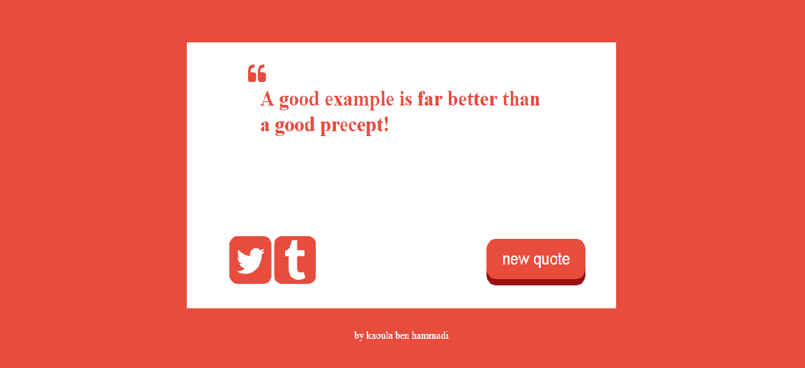

# Random Quote Machine
In this mini-project I have developed a  web application that displays random quote, as part of my full stack JavaScript training offered by [GOMYCODE Tunisia](https://www.gomycode.tn)
## Project brief
This is a small web application wich does the following:

<strong>User Story</strong> I can click a button to show me a new random quote.

<strong>User Story</strong> I can press a button to tweet out a quote.

The following screenshot shows my App:

	

To give you more of an idea, have a look at the demo <a href="https://devkah.github.io/random_quote_machine/">here</a>.

## What I have learned

* Use the Flexible Box Layout Module to postion in the elements of my page.

* Use jquery to manipulate the dom.

* learn how tweet from our page .